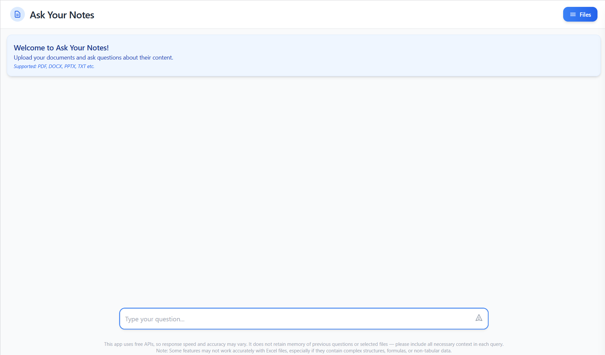
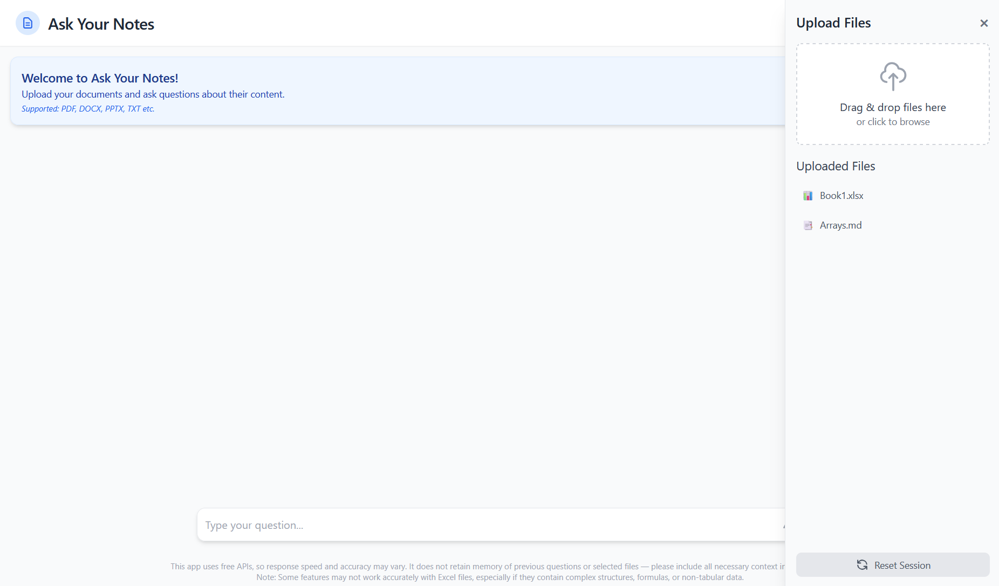
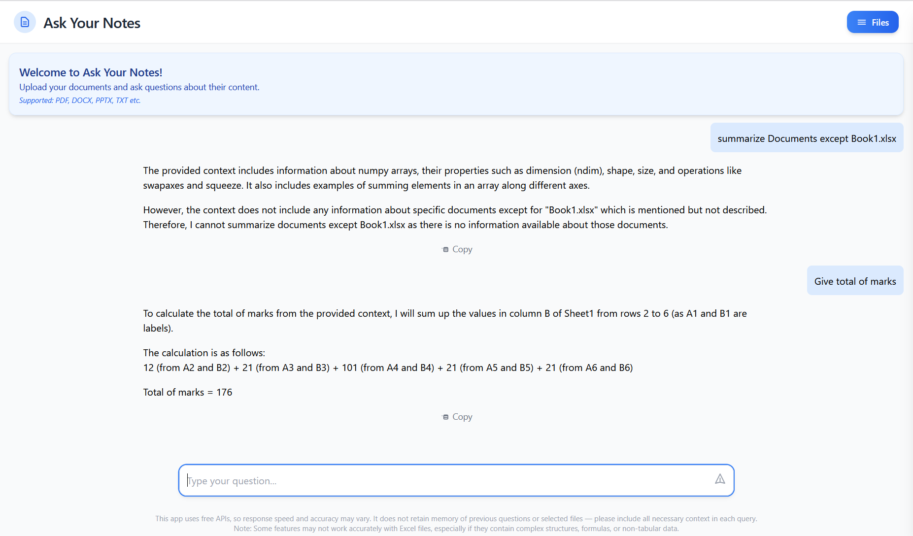

# 📄 Ask Your Notes

Ask Your Notes is a web-based document assistant built using Django and LangChain. It allows users to upload various document formats and ask context-based questions — perfect for students, researchers, or professionals working with data-heavy files.

---

## 📚 Table of Contents

- [Features](#features)
- [Tech Stack](#tech-stack)
- [Screenshots](#screenshots)
- [Installation](#installation)
- [Usage](#usage)
- [API Endpoints](#api-endpoints)
- [Limitations](#limitations)
- [Question Guidelines (Best Practices)](#question-guidelines-best-practices)
---

## Features

- 🧠 AI-powered Q&A based on uploaded documents
- 📂 Upload support for:
  - PDF, DOCX, PPTX, TXT, CSV, JSON, XLSX, MD, JPG/PNG, and more
- 💬 Tailored prompts for table data (e.g., Excel)
- 📊 Excel parsing with cell-level context
- 📎 File management: Upload, view, and delete
- 🔄 Session reset with file cleanup
- 🧾 Smart markdown rendering for answers
- 🎨 Fully responsive UI with Tailwind CSS

---

##  Tech Stack

**Backend:**
- Django
- Python 3.11+
- LangChain + HuggingFace Embeddings
- FAISS (vector storage)
- Mistral AI (LLM)
- OpenCV & Pytesseract (for OCR)

**Frontend:**
- Tailwind CSS
- HTML5 + JavaScript
- Marked.js (Markdown rendering)

---

## Screenshots



*With File Section*


*Q&A*

---

## Installation

### 1. Clone the Repository

```bash
git clone https://github.com/your-username/ask-your-notes.git
cd ask-your-notes
```

---

## Usage

Upload supported files (PDF, Excel, etc.)

Ask questions like:

- "What is the total budget in Sheet1?"

- "Give total of marks"

- "who got high mark?"

- "summarize Documents"

    Receive answers based on file content using LangChain's reasoning engine.

---
## API Endpoints

| Method | Endpoint | Description                    |
| ------ | ---------------------- | ------------------------------ |
| GET    | `/`                    | Main upload + QA interface     |
| POST   | `/upload_file/`        | Upload file                    |
| GET    | `/get_uploaded_files/` | Get list of uploaded files     |
| POST   | `/ask_question/`       | Ask question on uploaded files |
| POST   | `/reset_session/`      | Clear session & uploaded data  |
| POST   | `/delete_file/`        | Delete a specific file         |

---
## Limitations

- ⚡ LLM reliability varies: Responses depend on Mistral API availability and load. Failures or slow replies may occur during peak usage.

- 📊 No memory between questions: The system does not retain previous Q&A context — each question must be fully self-contained.

- 📁 Excel limitations: Complex Excel files with merged cells, empty rows/columns, or formulas may not be parsed correctly.

- ❌ Ambiguous questions may fail: Generic questions like “What is the total budget?” without context (e.g. sheet name or column) often return incomplete or wrong answers.

- 🧾 Data must be clearly structured: Unstructured PDFs or scanned images with poor OCR results can degrade performance.

- 📂 No cross-file reasoning: If multiple files are uploaded, answers are based on all, but the model cannot reliably cross-reference them unless explicitly guided.

### Question Guidelines (Best Practices)

Always ask complete and clear questions, including sheet names, column headers, and criteria.

🔍 Instead of:

>   "give high mark"

✅ Ask:

>   "give high value from mark table"

---

🔍 Instead of:

>   "list place"

✅ Ask:

>   "list PLACE from table"

---
**"If using spreadsheet with normal docs"**
🔍 Instead of:

> "list all topics"

✅ Ask:

> list all topics from document except "Book1.xlsx"
---

*For spreadsheet*
- Be explicit in your questions

- Mention column names

- Avoid assuming the model remembers previous context

- When in doubt, rephrase the question with full detail